For the given code below:

- create the execution context diagram
- re-write the code in ways that system will understand/interprete

1.

```js
var username = 'Arya';
let brothers = ['John', 'Ryan', 'Bran'];

console.log(username, brothers[0]);

function sayHello(name) {
  return `Hello ${name}`;
}

let message = sayHello(username);
var nextMessage = sayHello('Test');
```
- The solution for above code is in this 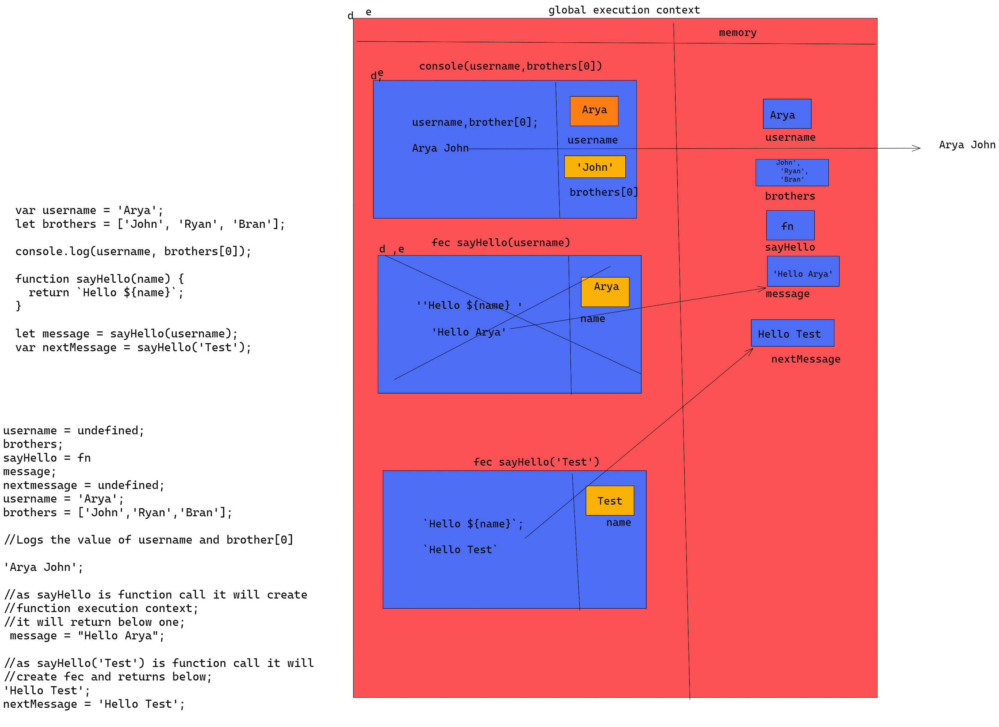

2.

```js
console.log(username, numbers);

var username = 'Arya';
let number = 21;

function sayHello(name) {
  return `Hello ${name}`;
}

let message = sayHello(username);
var nextMessage = sayHello('Test');
```
- The solution for above code is in this 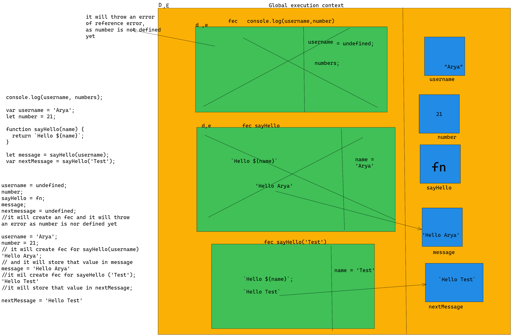
3.

```js
console.log(username, numbers);

let username = 'Arya';
let number = 21;

let sayHello = function (name) {
  return `Hello ${name}`;
};

let message = sayHello(username);
var nextMessage = sayHello('Test');
```
- The solution for the above code is in this 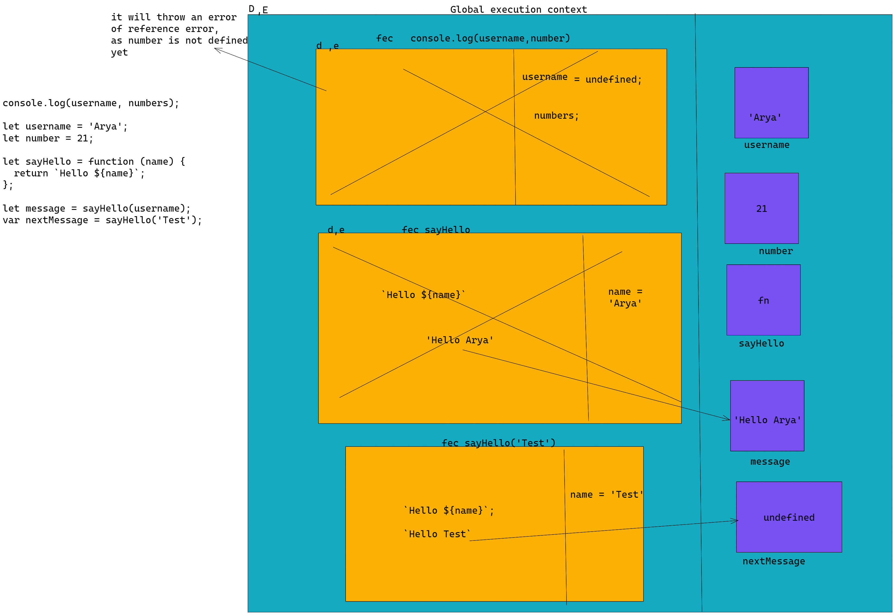
4.

```js
let username = 'Arya';
console.log(username, numbers);

let number = 21;
let message = sayHello(username);

let sayHello = function (name) {
  return `Hello ${name}`;
};

var nextMessage = sayHello('Test');
```
- The solution for the above code is in this 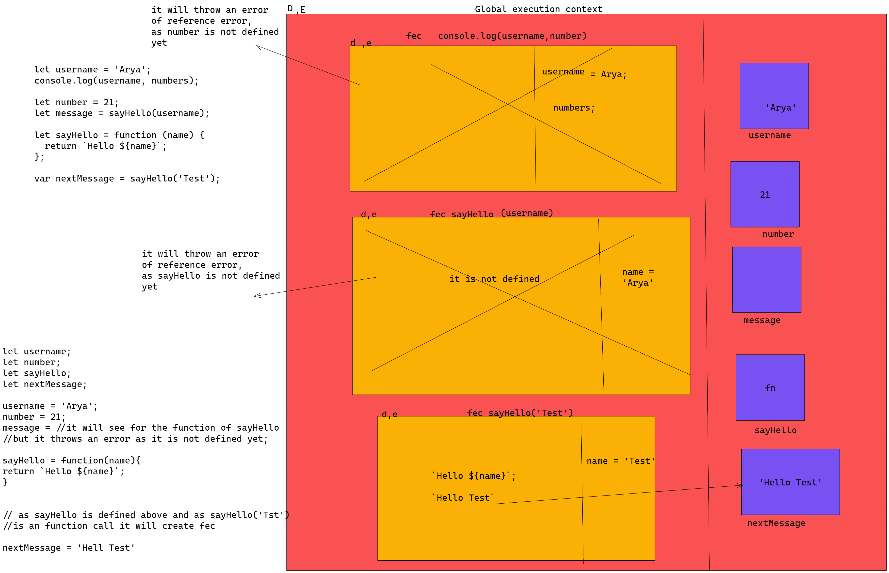
5.

```js
console.log(name);
console.log(age);
var name = 'Lydia';
let age = 21;
```
- The solution for the above code is in this 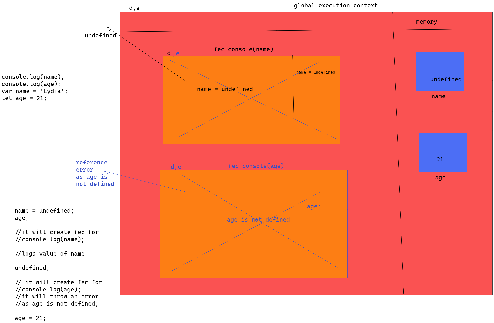
6.

```js
function sayHi(name) {
  console.log(name);
  console.log(age);
  var name = 'Lydia';
  let age = 21;
}

sayHi();
```
- The solution for the above code is in this 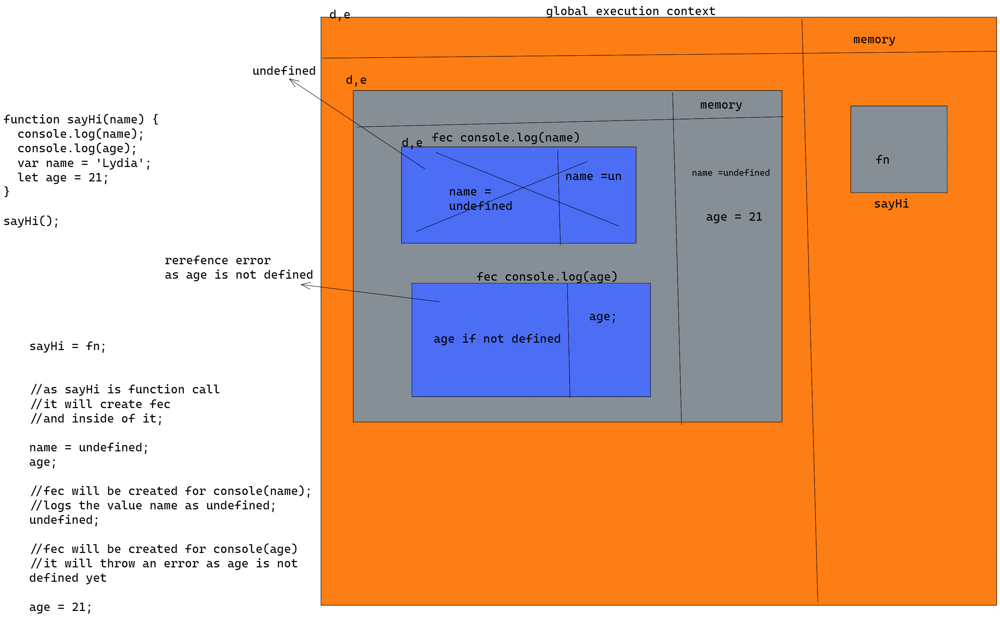
6.

```js
sayHi();
function sayHi(name) {
  console.log(name);
  console.log(age);
  var name = 'Lydia';
  let age = 21;
}
```
- The solution for the above code is in this 
7.

```js
sayHi();
let sayHi = function sayHi(name) {
  console.log(name);
  console.log(age);
  var name = 'Lydia';
  let age = 21;
};
```
- The solution for the above code is in this 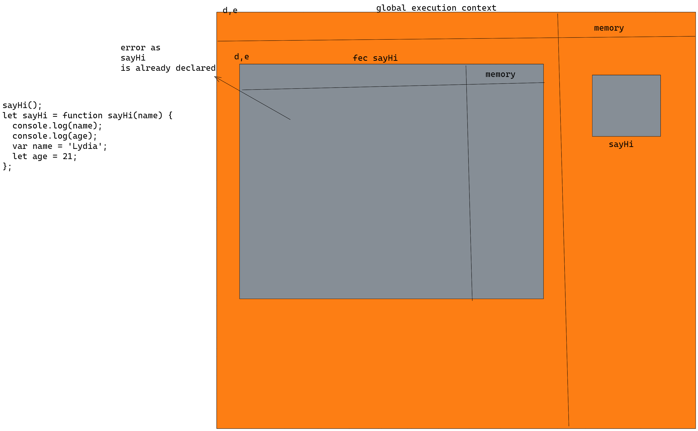
8.

```js
let num1 = 21;
console.log(sum);
var sum = num1 + num2;
let num2 = 30;
```
- The solution for the above code is in this 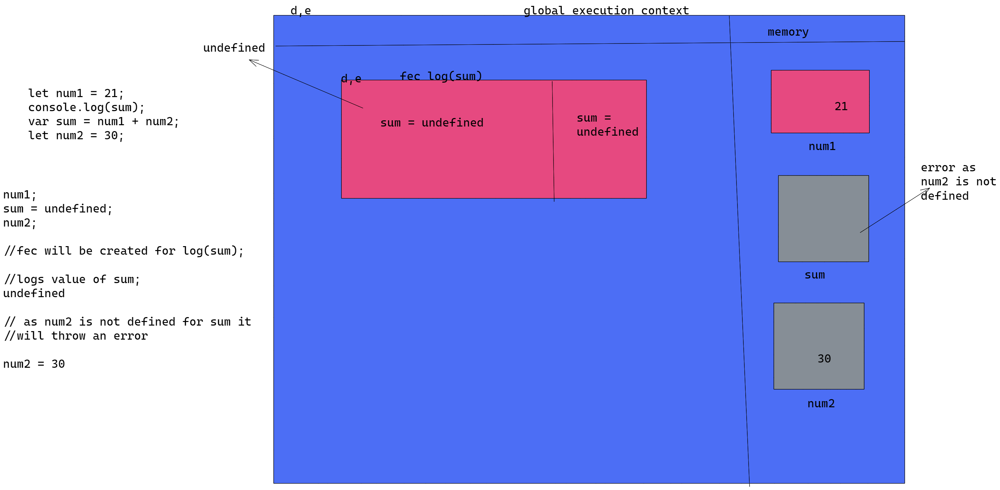
9.

```js
var num1 = 21;

let sum2 = addAgain(num1, num2, 4, 5, 6);

let add = (a, b, c, d, e) => {
  return a + b + c + d + e;
};
function addAgian(a, b) {
  return a + b;
}
let num2 = 200;

let sum = add(num1, num2, 4, 5, 6);
```
- The solution for the above code is in this 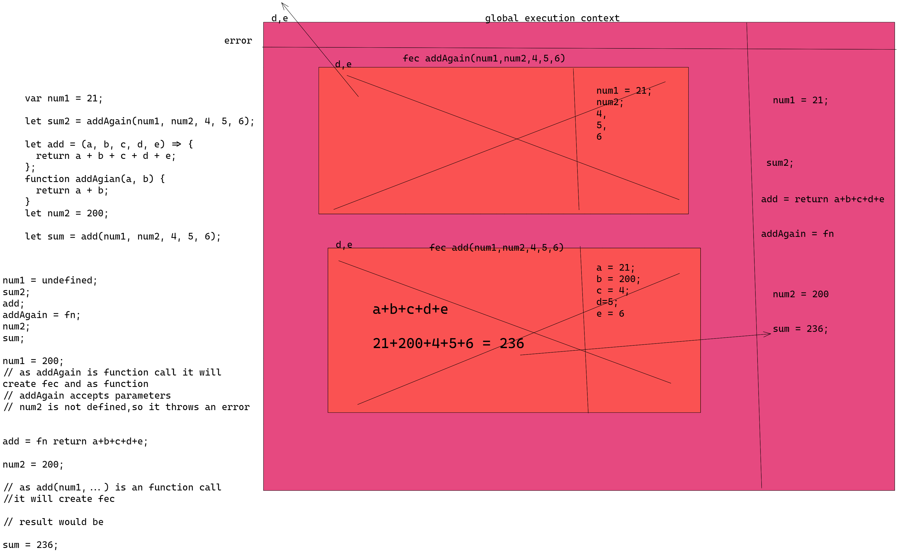
10.

```js
function test(a) {
  let num1 = 21;
  return add(a, num1);
}

let sum = test(100);

let add = (a, b) => {
  return a + b;
};
```
- The solution for the above code is in this 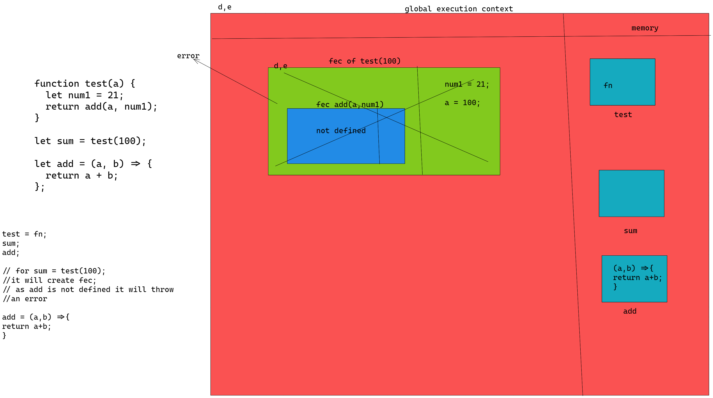
11.

```js
function test(a) {
  let num1 = 21;
  return add(a, num1);
}

let sum = test(100);

function add(a, b) {
  return a + b;
}
```
- The solution for the above code is in this 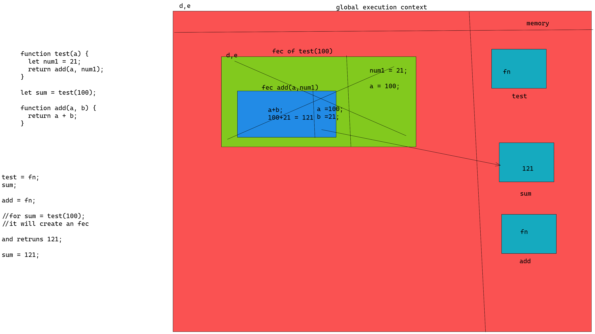